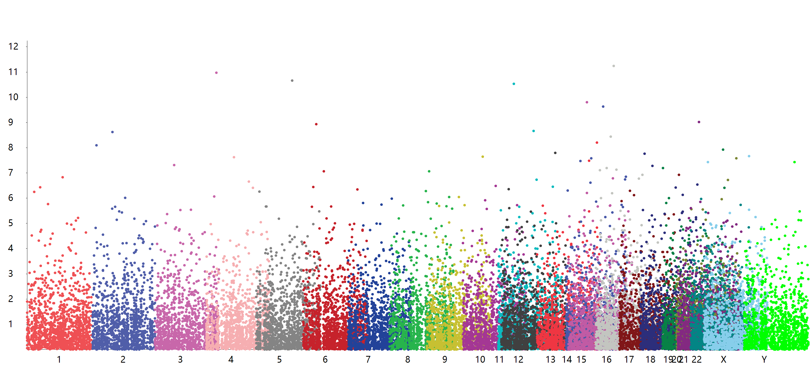

# ManhattanPlot
Manhattan plot in VisualBasic

## [Manhattan plot](https://en.wikipedia.org/wiki/Manhattan_plot)

A Manhattan plot is a type of scatter plot, usually used to display data with a large number of data-points - many of non-zero amplitude, and with a distribution of higher-magnitude values, for instance in genome-wide association studies (GWAS).[1] In GWAS Manhattan plots, genomic coordinates are displayed along the X-axis, with the negative logarithm of the association P-value for each single nucleotide polymorphism (SNP) displayed on the Y-axis, meaning that each dot on the Manhattan plot signifies a SNP. Because the strongest associations have the smallest P-values (e.g., 10−15), their negative logarithms will be the greatest (e.g., 15).

It gains its name from the similarity of such a plot to the Manhattan skyline: a profile of skyscrapers towering above the lower level "buildings" which vary around a lower height.

## References
+ Gibson, Greg (2010). "Hints of hidden heritability in GWAS". Nature Genetics. 42 (7): 558–560. doi:10.1038/ng0710-558. PMID 20581876.
 

