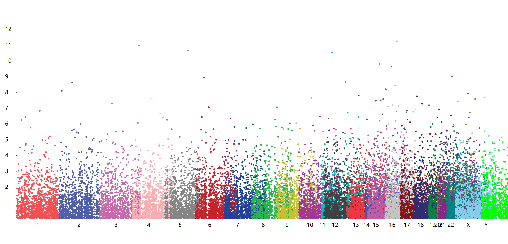
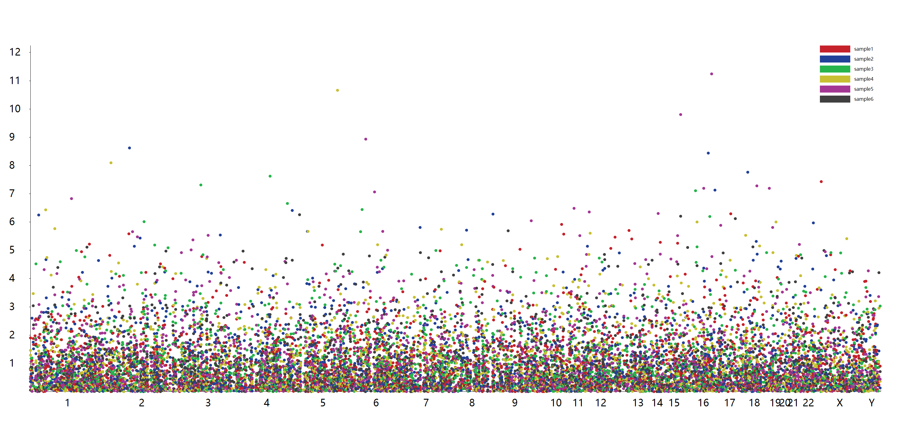
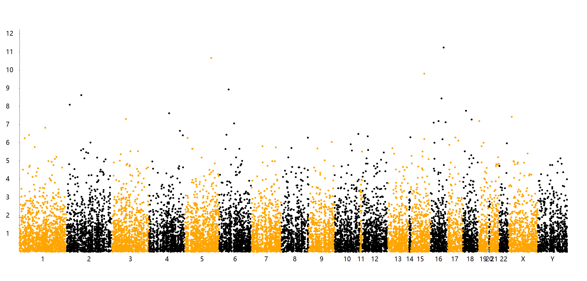
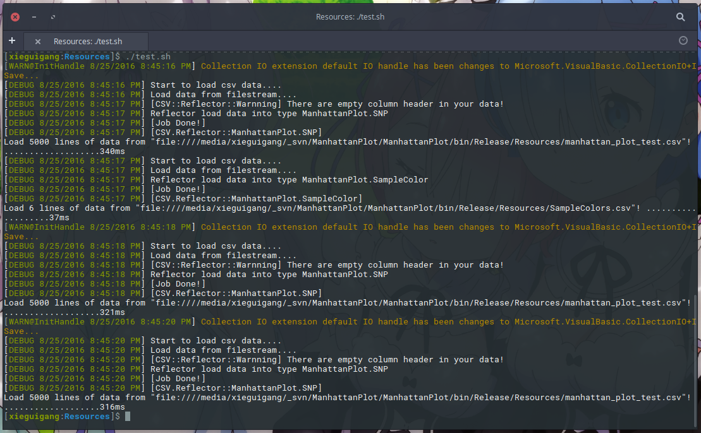

# ManhattanPlot
Manhattan plot in VisualBasic, application of the cross platform VisualBasic in the data science area.

For start the further development, install the Microsoft VisualBasic CLI runtime first:

```bash
PM> Install-Package VB_AppFramework
```

and then add reference to the dll files:

+ Microsoft.VisualBasic.Architecture.Framework_v3.0_22.0.76.201__8da45dcd8060cc9a.dll
+ Microsoft.VisualBasic.DocumentFormat.Csv.dll

## [Manhattan plot](https://en.wikipedia.org/wiki/Manhattan_plot)

> wiki: https://en.wikipedia.org/wiki/Manhattan_plot

A Manhattan plot is a type of scatter plot, usually used to display data with a large number of data-points - many of non-zero amplitude, and with a distribution of higher-magnitude values, for instance in genome-wide association studies (GWAS).[1] In GWAS Manhattan plots, genomic coordinates are displayed along the X-axis, with the negative logarithm of the association P-value for each single nucleotide polymorphism (SNP) displayed on the Y-axis, meaning that each dot on the Manhattan plot signifies a SNP. Because the strongest associations have the smallest P-values (e.g., 10−15), their negative logarithms will be the greatest (e.g., 15).

It gains its name from the similarity of such a plot to the Manhattan skyline: a profile of skyscrapers towering above the lower level "buildings" which vary around a lower height.

## References
+ Gibson, Greg (2010). "Hints of hidden heritability in GWAS". Nature Genetics. 42 (7): 558–560. doi:10.1038/ng0710-558. PMID 20581876.


## Using the code

First, peeks of the test data. By using **[``sampleTest.R``](./docs/sampleTest.R)** script for generates the test data set.

```R
# 生成测试数据集

size <- 5000

Chr = sample(1:24,size,replace=T)
Position = sample(1:247249719,size)

sample1 = runif(size)
sample2 = runif(size)
sample3 = runif(size)
sample4 = runif(size)
sample5 = runif(size)
sample6 = runif(size)

df <- data.frame(Chr, Position, sample1, sample2, sample3, sample4, sample5, sample6)

write.csv(df, "./manhattan_plot_test.csv")
```

```R
df <- read.csv("./manhattan_plot_test.csv")
head(df)
#   X Chr  Position   sample1    sample2   sample3     sample4    sample5   sample6
# 1 1   2  22304208 0.4507433 0.01808137 0.5331228 0.886314430 0.05588127 0.9862486
# 2 2   4 230231679 0.6635587 0.27899222 0.9481844 0.531249994 0.21041159 0.3363624
# 3 3  10 143893892 0.1996261 0.48332127 0.2450963 0.361027239 0.52686846 0.8066759
# 4 4  16 132975412 0.8251777 0.20714878 0.8853197 0.940708435 0.13193652 0.1899054
# 5 5   5  40889369 0.1213144 0.26543908 0.5174160 0.003453829 0.25054001 0.8672608
# 6 6  17   7449617 0.1840310 0.10817737 0.2458615 0.570825707 0.38563234 0.1185492
```

And then load data into memory by using code

```vbnet
Imports Microsoft.VisualBasic.DocumentFormat.Csv

Dim data As SNP() = "./manhattan_plot_test.csv".LoadCsv(Of SNP)
```

Canvas drawing of the ``Manhattan Plot`` is super easy by using just one function:

```vbnet
Canvas.Plot(System.Collections.Generic.IEnumerable(Of ManhattanPlot.SNP), Integer, Integer, System.Collections.Generic.Dictionary(Of String, String), System.Drawing.Size, Integer, Boolean, Boolean, Boolean, String, String) As System.Drawing.Bitmap
```

#### Color patterns

Save image method extension required of imports namespace:

```vbnet
Imports Microsoft.VisualBasic.Imaging
```

```vbnet
Dim image As Bitmap = data.Plot(colorPattern:="chr")
Call image.SaveAs("./manhattan_plot_test.png", ImageFormats.Png)
```



```vbnet
Dim image As Bitmap = data.Plot(colorPattern:="sampleName")
Call image.SaveAs("./manhattan_plot_test_sampleName.png", ImageFormats.Png)
```



```vbnet
Dim image As Bitmap = data.Plot(colorPattern:="interval")
Call image.SaveAs("./manhattan_plot_test_interval.png", ImageFormats.Png)
```


## Test on Linux
This program have been test successfully on the Ubuntu Linux system and Windows10, here is the test script example that you can found in the demo ``Resources`` folder:

```bash
#!/bin/bash

rm ./manhattan_plot_test_chr.png
rm ./manhattan_plot_test_interval.png
rm ./manhattan_plot_test_SampleName.png

../ManhattanPlot.exe /Draw /in "./manhattan_plot_test.csv" /pt.size 10 /sampleColors "./SampleColors.csv" /colorpattern SampleName
../ManhattanPlot.exe /Draw /in "./manhattan_plot_test.csv" /pt.size 10 /colorpattern chr
../ManhattanPlot.exe /Draw /in "./manhattan_plot_test.csv" /pt.size 10 /colorpattern interval
```

